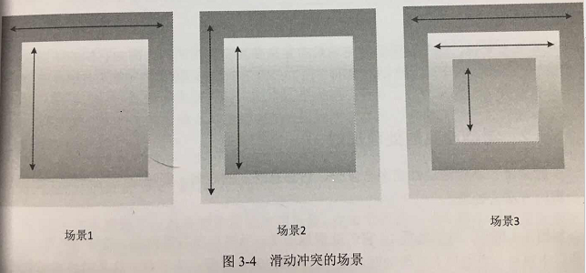

# Review For Android
***
## View 的事件体系
***
### View 的滑动冲突   

常见的滑动冲突场景：  
1.**外部滑动方向** 和 **内部滑动方向** 不一致.  
2.**外部滑动方向** 和 **内部滑动方向** 一致.  
3.上面两种情况嵌套   
  

场景一：**ViewPager** 和 **Fragment** 的配合使用，而每个页面的内部往往又是一个 **ListView** ，而 **ViewPager** 内部处理了这种滑动冲突，而如果是 **ScrollView** ，那就需要手动处理滑动冲突了.  

场景二： 内外两层同一个方向滑动.

场景三： 比如外部有个 **SlideMenu** 的效果，然后内部又有一个 **ViewPager**，**ViewPager** 里面又有 **ListView** ，这种冲突是几个单一的滑动冲突的叠加，因此需要分别处理内层和中间层，中间层和外层之间的滑动冲突即可.  

***
### View 的滑动冲突的处理规则  

对于场景一：根据滑动是水平滑动还是竖直滑动来判断到底是由谁来拦截事件，比如我们可以通过水平和竖直方向的距离差来判断，比如竖直方向滑动的距离大就判断为竖直滑动，否则判断为水平滑动。

对于场景二：无法根据滑动的角度，距离差以及速度差来做判断，这个时候一般在业务上找到突破点，

对于场景三：同二更复杂.  

***
### View 的滑动冲突的解决方式 
**外部拦截法** ， **内部拦截法**  
具体例子：见**《Android开发艺术探索》- 任玉刚 - p157 - p173**  
