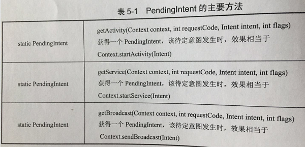

# Review For Android
***
## RemoteView
***
### RemoteView 的应用   

**1.**通知栏上的应用：使用系统默认的样式弹出一个通知  (**Notification** 类的使用)  

**2.** **RemoteViews** 在桌面小部件的应用，**AppWidgetProvider** 是 **Android** 中提供的用于实现桌面小部件的类，是 **BroadcastProvider** 的继承类，小部件的开发步骤一般分为如下几步：  
(1). 定义小部件界面 : 在 **res/layout/** 下新建一个 **XML** 文件，命名为 **widget.xml**，名称和内容可以自定义.   
(2). 定义小部件配置信息 : 在 **res/xml/** 下新建 **appwidget\_provider\_info.xml**,名称随意选择  
(3). 定义小部件的实现类 : 这个类需要继承 **AppWidgetProvider**.   
(4). 在 **AndroidManifest.xml** 中声明小部件.  
具体案例 : 见 **《Android开发艺术探索》- 任玉刚 - p221 - p227**  

**3.** **AppWidgetProvider** 的一些方法：  
**onEnable()** : 当该窗口小部件第一次添加到桌面时调用该方法，可添加多次但是只在第一次调用.  
**onDeleted()** : 每删除一次桌面小部件就调用一次.  
**onDisabled()** :  当最后一个该类型的桌面小部件被删除时调用该方法，注意是最后一个.  
**onReceive()** : 这是广播的内置方法，用于分发具体的事件给其他方法.

***
### PendingIntent 概述 

**1.** **PendingIntent** 表示一种处于待定、等待、即将发生状态的意图，和 **Intent** 的区别在与，**PendingIntent** 典型的使用场景是给 **RemoteView** 添加单击事件，因为 **RemoteViews** 运行在远程进程中，因此 **RemoteViews** 不同于普通的 **View** ，所以无法直接向 **View** 那样通过 **setOnClickListener** 方法来设置单击事件，要想给 **RemoteView** 设置单击事件，就必须使用 **PendingIntent** ， **PendingIntent** 通过 **send()** 和 **cancel()** 方法来发送和取消特定的待定 **Intent**.  
  
**2.** **PendingIntent** 支持三种待定意图 : **启动Activity** 、**启动Service** 和 **发送广播**，对应着它的三个方法接口 :   

 

**PendingIntent** 的匹配规则为 : 如果两个 **PendingIntent** 它们内部的 **Intent** 相同并且 **requestCode** 也相同，那么这两个 **PendingIntent** 就是相同的。关于上述 **flags** 参数的含义，**flags**常用的类型有如下几种，如下所示 :  

**FLAG\_ONE\_SHOT** : 当前描述的 PendingIntent 只能被使用一次，然后它就会被 **cancel()** , 如果后续还有相同的 **PendingIntent**，那么它们的 **send()** 方法就会调用失败 , 对于通知栏消息来说，如果采用次标记位，那么同类的通知只能使用一次，后续的通知单击后将无法打开.  
  
**FLAG\_NO\_CREATE** : 当前描述的 **PendingIntent** 不会主动创建，如果当前 **PendingIntent** 之前不存在，那么上表三个方法都会返回 **null** ，这个标记位很少见，无法单独使用，一般用不到. 

**FLAG\_CANCEL\_CURRENT** : 当前描述的 **PendingIntent** 如果已经存在，那么它们都会被 **cancel()** ,然后系统会创建一个新的 **PendingIntent**. 对于通知栏消息来说，那些被 **cancel()** 的消息单击后将无法打开.  

**FLAG\_UPDATE\_CURRENT** : 当前描述的 **PendingIntent** 如果已经存在，那么它们都会被更新，即它们的 **Intent** 中的 **Extras** 会被替换成最新的.  

标记位的具体案例：具体案例 : 见 **《Android开发艺术探索》- 任玉刚 - p229 - p230**  

***
### **RemoteViews** 的内部机制  

**1.** **RemoteViews** 最常用的构造方法 : **public RemotesViews(String packageName，int layoutId)**，两个参数分别表示 **当前应用的包名** 和 **待加载的布局文件**，**RemoteViews** 并不能支持所有的 **View** 类型，它所支持的类型如下 :  

**Layout** :   
**FrameLayout**、**LinearLayout**、**RelativeLayout**、**GridLayout**.  

**View** :  
**AnalogClock**、**Button**、**Chronometer**、**ImageButton**、**ImageView**、**ProgressBar**、**TextView**、**ViewFlipper**、**ListView**、**GridView**、**StackView**，**AdapterViewFlipper**、**ViewStub**. 

除了上述 **View** 类型，**RemoteViews** 不支持其他 **View** 类型，即时是它们的子类也不行，更加无法使用自定义 **View**，**RemoteViews** 无法直接访问里面的 **View** 元素，必须通过 **RemoteViews** 所提供的一系列 **set** 方法完成，而事实上大部分的 **set**  方法的确是通过反射来完成的.  

关于 **RemoteViews** 的内部机制及工作过程的具体分析 见 **《Android开发艺术探索》- 任玉刚 - p231 - p238**  

