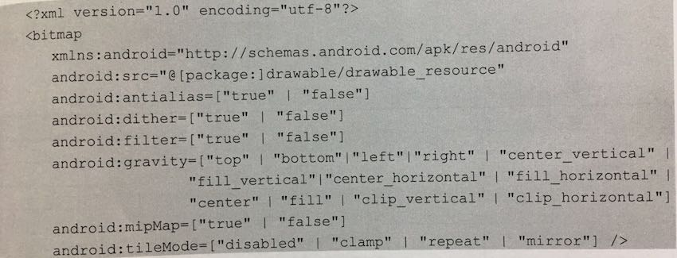
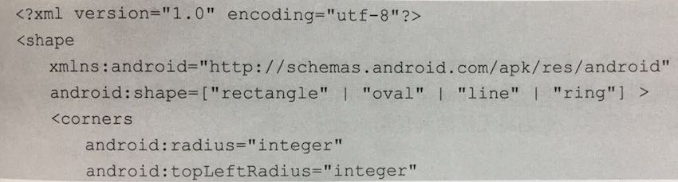
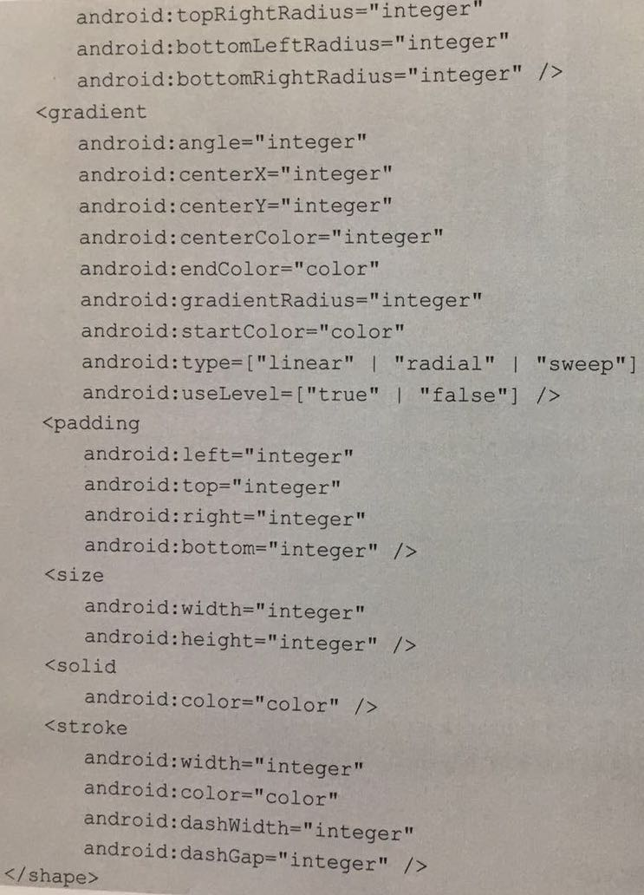

# Review For Android
***
## Drawable
***
### Drawable 简介
**1.** **Drawable** 有很多种，它们都表示一种图像的概念，但是不全是图片，在实际开发中，**Drawable** 常被用来作为 **View** 的背景使用，**Drawable** 一般通过 **XML** 来定义，也可以用代码创建具体 **Drawable** 对象，稍显复杂，**Android** 设计中，**Drawable** 是一个抽象类。  

**2.** **Drawable** 的内部宽／高这个参数比较重要，通过 **getInrinsicWidth()** 和 **getIntrisicHeight()** 获得，一张图片所形成的 **Drawable** ，它的内部宽高就是图片的宽高，但是一个颜色所形成的 **Drawable** 没有内部宽高的概念，也没有大小概念。  

**3.** **Drawable** 的层次关系如下图所示： 

   
 
***
### Drawable 的分类

**1.** **BitmapDrawable** : 它就是表示一张图片，直接引用原始的图片即可，但是也可以通过 **XML** 的方式来描述的 **BitmapDrawable** 可以设置更多的效果，如下图所示：   

 

具体属性含义：见 **《Android开发艺术探索》- 任玉刚 - p245** 

**2.** **ShapeDrawable** ：理解为通过颜色来构造的图形，它既可以是纯色的图形，也可以是具有渐变效果的图形，具体语法如下所示 ： 

  

  

具体属性含义：见 **《Android开发艺术探索》- 任玉刚 - p248 - p251** 

**3.** 更多非常用 **Drawable** 请查阅 **《Android开发艺术探索》- 任玉刚 6.2章节**

   